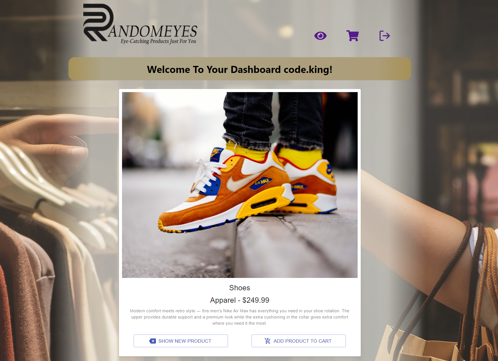

# Randomeyes ©2021 

## Description
Randomeyes is a contemporary MERN application that blends aspects of e-commerce sites like Amazon with dating apps like Bumble.  Users “swipe” through high-quality products that are sure to amaze. If you see something that catches your eye, click the “keep” button. If it doesn’t, then discard and continue browsing! Randomeyes only offers the best brand names. Products from any industry or genre can be found. We are continuously updating our product offering to ALWAYS provide something fresh for our customers. Once a user has “liked” all of their products, they can navigate to the cart to view what they are going to purchase. They can remove anything they may have been too hasty to add and checkout!  

Project by: Sean Brent, Swan Pham, Peter Wang, Danyal Khanzada

Github Repository Link: https://github.com/Brentsa/random-eyes  
Live Page Url: https://randomeyes.herokuapp.com/ 

## Table of Contents
* [Usage](#usage)
* [Contributon](#contribution)
* [License](#license)
* [Questions](#questions)

## Usage 
Consumers are faced with an infinite amount of product choices in 2021. Searching for the simplest of items online can yield hundreds of results. Astronomical variation between prices, aggregate reviews that are biased, and product knock-offs all plague the modern online shopping experience. The insane amount of choice can leave shoppers feeling paralysed when trying to decide what to buy. If you've felt this way before then Randomeyes is the shop for you!  

Randomeyes brings back the good old days of walking into a shop and not knowing what you might come out with. Our team hand picks top of the line products from reputable suppliers. These products are then presented to you in single file with a random order. If you like a product you can add it to your cart and purchase it later on. If you don't have an interest in the product then you can pass on it and move to the next product in line. You never know what hidden gems you might find on Randomeyes but your enjoyment will always be guaranteed. 

Website Screenshot:  

## Contribution
Sean Brent - [Brentsa](https://github.com/Brentsa)  
Swan Pham - [swanpham]()  
Peter Wang - [peterw712]()  
Danyal Khanzada - [DanyalKhanzada](https://github.com/DanyalKhanzada)  

## License
  
[Click here for more information on this license](https://choosealicense.com/licenses/unlicense)

## Questions
If you have questions or would like to contact for other reasons, please contact:
Sean Brent, Swan Pham, Peter Wang, or Danyal Khanzada  

[Sean Brent](https://github.com/Brentsa) - Email: seanbrent5@live.ca  
[Swan Pham]() - Email: swan@nailsrus.ca  
[Peter Wang]() - Email: peterw712@outlook.com  
[Danyal Khanzada]() - Email: danyalkhanzada89@gmail.com  
